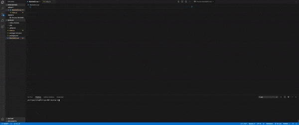

# Unit 09 Node.js and ES6+ Homework: Good README Generator
README Generator
```

The user will be prompted for their GitHub username, which will be used to make a call to the GitHub API to retrieve their email and profile image. They will then be prompted with questions about their project.

The README will be populated with the following:

* User GitHub profile picture 
* User GitHub email
* At least one badge
* Project title
* Description
* Table of Contents
* Installation
* Usage
* License
* Contributing
* Tests
* Questions


```
GIVEN the developer has a GitHub profile and a repository

WHEN prompted for the developer's GitHub username and repo specific information

THEN a README for the repo is generated
```

# Demo

 / 
